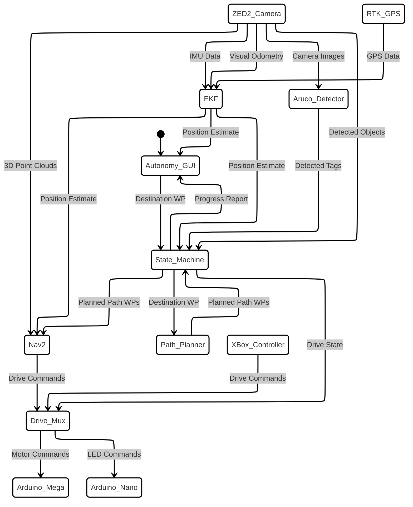

```mermaid
---
config:
  layout: elk
  theme: neo
  look: classic
---
stateDiagram-v2
  direction TB
  [*] --> Autonomy_GUI
  Autonomy_GUI --> State_Machine:Destination WP
  State_Machine --> Autonomy_GUI:Progress Report
  State_Machine --> Nav2:Planned Path WPs
  State_Machine --> Path_Planner:Destination WP
  Path_Planner --> State_Machine:Planned Path WPs
  State_Machine --> Drive_Mux:Drive State
  Nav2 --> Drive_Mux:Drive Commands
  XBox_Controller --> Drive_Mux:Drive Commands
  Drive_Mux --> Arduino_Mega:Motor Commands
  Drive_Mux --> Arduino_Nano:LED Commands
  ZED2_Camera --> EKF:IMU Data
  ZED2_Camera --> EKF:Visual Odometry
  ZED2_Camera --> Nav2:3D Point Clouds
  ZED2_Camera --> Aruco_Detector:Camera Images
  ZED2_Camera --> State_Machine:Detected Objects
  Aruco_Detector --> State_Machine:Detected Tags
  RTK_GPS --> EKF:GPS Data
  EKF --> State_Machine:Position Estimate
  EKF --> Autonomy_GUI:Position Estimate
  EKF --> Nav2:Position Estimate
```

--

Created by Nelson Durrant, Jun 2025